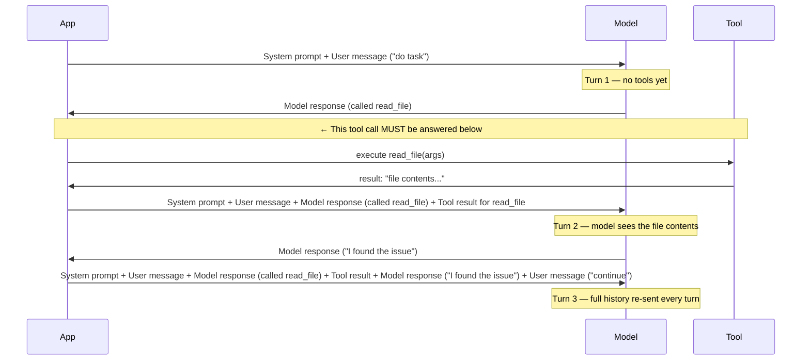
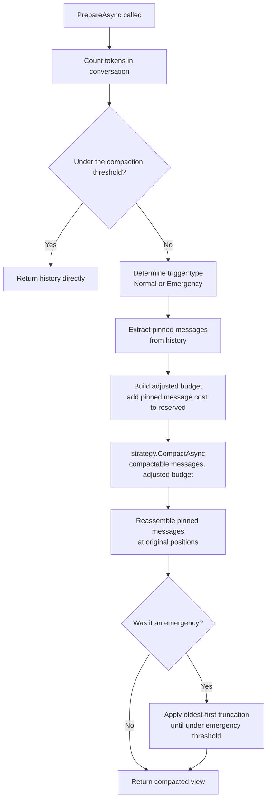
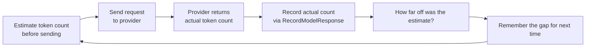
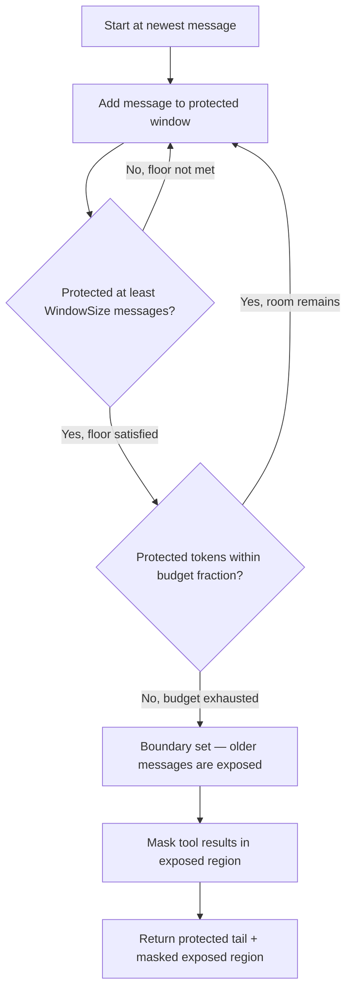
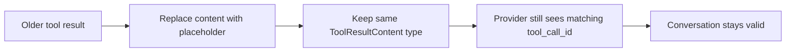
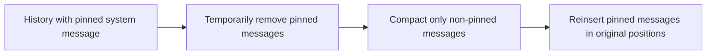

# How TokenGuard Thinks About Context

If you've ever built an LLM agent that uses tools, you've probably hit one of these:

- The conversation grows so large the model hits its context window limit and the run hard-fails.
- Your API costs spike because turn 15 is sending everything from turn 1 again.
- The model gets confused because it has 80,000 tokens of stale file reads in front of it.

TokenGuard is a .NET library that handles all three. This document explains how it works — not just what the API looks like, but *why* each design decision was made and what breaks if you get it wrong.

---

## 1. The Problem — Why Context Management Exists

LLMs are stateless. Every call to the chat API sends the entire conversation from scratch. There is no server-side memory. The model doesn't "remember" turn 5 — it re-reads it, along with turns 1 through 4, on every subsequent request.

Agent loops make this dramatically worse. A typical tool-calling loop looks like this: the model makes a tool call, you execute the tool, you send the result back, the model reasons about it, makes another tool call, and so on. Every loop iteration adds at least three messages (assistant with tool call, tool result, next assistant message). More importantly, each call's *input* includes every message that came before it.

This means token consumption doesn't grow linearly — it grows superlinearly. Here's the concrete data from our API Contract Audit benchmark: an 11-turn agent loop that ran without any context management accumulated **125,821 total input tokens** across all turns. That's the sum across all 11 requests. Turn 11 alone sent 17,416 tokens, up from 813 tokens on turn 1. The model was reading a 20x larger context at the end than at the start.

```
Turn | Raw Input Tokens | Managed Input Tokens
-----|-----------------|---------------------
  1  |             813  |               813
  2  |             872  |               872
  3  |          12,097  |            12,097
  4  |          12,318  |            12,299  ← first compaction
  5  |          12,693  |            10,573
  6  |          13,060  |             7,242
  7  |          13,315  |             4,105
  8  |          13,851  |             3,793
  9  |          14,485  |             4,214
 10  |          14,901  |             6,943
 11  |          17,416  |           (done in 10 turns)
     |                  |
Total|         125,821  |            62,951
```

50% input token reduction. Same task, same model. Wall clock time was essentially identical (28.5s vs 27.4s).

Why does this matter beyond cost? Three reasons:

1. **Cost scales with input tokens.** Every token in the request is charged.
2. **Latency scales with input tokens.** Larger prompts take longer to process.
3. **Context windows are finite.** Eventually you hit the hard limit and the run fails entirely. No graceful degradation — just a 400 error from the provider.

---

## 2. What LLMs Actually See — The Illusion of Memory

The chat API is a simple contract: you send an array of messages, you get a response. The model doesn't know it's seen those messages before. It re-reads every single one, every single turn.

The message array has structural rules. For OpenAI's chat API specifically:

- Roles must alternate correctly. You can't have two consecutive user messages.
- Every `tool_calls` entry in an assistant message **must** have a corresponding `tool` role message with a matching `tool_call_id`. This isn't optional — violate it and you get a 400 error.
- System messages belong at the top.
- Content can't be empty.

The model is a fragile consumer. These aren't soft guidelines — they're hard API contracts enforced server-side. Small violations don't degrade gracefully. They fail immediately.



This is the fundamental constraint that makes context management hard: **you can't just delete messages**. If you drop the tool result, the preceding assistant message still references its `tool_call_id`. The provider sees an orphaned tool call and returns a 400. The structural contract must be preserved even when you're trying to shrink the conversation.

---

## 3. TokenGuard's Mental Model — The Two Worlds

TokenGuard maintains two distinct views of a conversation.

**History** (`ConversationContext.History`) is the complete, unmodified record of everything that happened. Messages are added to it via `AddUserMessage`, `RecordModelResponse`, and `RecordToolResult`. Nothing is ever removed from it. It only grows.

**Prepared view** (`PrepareAsync()` output) is the snapshot that gets sent to the provider. It may be compacted. It is not stored back into history. Every call to `PrepareAsync()` re-evaluates the full history from scratch.



Here's the critical insight: because `PrepareAsync()` always works from `_history` (which never changes), once the history crosses the compaction threshold, **the strategy runs every subsequent turn**. Not just once. The history never drops below the threshold because it never changes.

This surprises people. They expect "compact once, stay small." That's not how it works. The prepared view is ephemeral — it's produced fresh each turn and discarded. The history accumulates everything.

This is intentional:

- **Benefit:** The original conversation record is always intact. You can inspect the full history, replay it, log it, or recover from errors. Nothing is permanently lost.
- **Cost:** The strategy runs on every turn after the threshold is crossed.

For the sliding window strategy, this cost is negligible — it's a synchronous O(n) scan with no API calls. For a future LLM summarization strategy, this design will need caching. Summarization requires its own LLM call, and you don't want that on every turn.

---

## 4. The Token Estimation Problem — Guessing Before You Know

To decide whether to compact, TokenGuard needs to know how many tokens the conversation is. But the real token count is only known *after* the provider processes the request. You need to estimate before you send.

`EstimatedTokenCounter` uses a simple heuristic: `ceiling(totalChars / 4.0) + 4` per message. The `+4` is a per-message structural overhead. This is fast, allocation-free, and roughly 85–95% accurate for English text with a BPE tokenizer. The chars-per-token ratio is calibrated for GPT-family models where 4 characters ≈ 1 token in typical English prose.

```csharp
public int Count(ContextMessage contextMessage)
{
    long totalChars = 0;
    foreach (var segment in contextMessage.Segments)
    {
        totalChars += segment switch
        {
            TextContent text => text.Content.Length,
            ToolUseContent toolUse => toolUse.ToolName.Length + toolUse.Content.Length,
            ToolResultContent toolResult => toolResult.ToolCallId.Length + toolResult.Content.Length,
            _ => 0
        };
    }
    return (int)Math.Ceiling(totalChars / 4.0) + 4;
}
```

The estimator can be wrong. Code has a higher token-to-character ratio than prose. Non-Latin scripts (CJK, Arabic) can have 1–2 characters per token. JSON with dense punctuation is harder to estimate. Over a long conversation, small per-message errors accumulate.

The **anchor correction** mechanism exists to fix systematic drift. When you call `RecordModelResponse` with the `providerInputTokens` argument, the context computes:

```
correction = providerTokens - lastPreparedTotal
```

This correction is stored and applied additively to every future `PrepareAsync` estimate. If the estimator is consistently undercounting by 200 tokens per call, the correction closes that gap.



The **post-compaction reset** is equally important: after compaction runs, both `_lastPreparedTotal` and `_anchorCorrection` are reset to zero. Why? Because the compaction changed the shape of the prepared message list. The correction was calibrated against the pre-compaction message set. Applying it to the post-compaction set would cause the next threshold check to oscillate — triggering compaction, then not triggering, then triggering again — because the correction was tuned for a different message structure.

---

## 5. The Sliding Window Strategy — What Gets Cut and Why

The core insight behind the sliding window strategy comes from JetBrains research ("Cutting Through the Noise: How LLM-Agents Manage Context," NeurIPS 2025): in agent trajectories, approximately **84% of tokens are tool/observation data**. The agent's own reasoning is only ~16%. If you can target observations for removal, you get maximum token savings with minimum information loss. See JetBrains' write-up: https://blog.jetbrains.com/research/2025/12/efficient-context-management/

The reasoning is sound: a model only needs the raw contents of a file read during the turn when it's actively processing that file. After it's reasoned about it and moved on, the raw 10,000-token file read is dead weight. The model already "used" it.

### How the Boundary Walk Works

The strategy walks backward from the newest message, building a "protected" tail. It always protects at least `WindowSize` messages (default: 10) unconditionally. After that floor is satisfied, it continues expanding the protected window while the token cost stays within `ProtectedWindowFraction` of the available budget (default: 80%).



### What Masking Does

For messages in the "exposed" segment (before the boundary), any `ToolResultContent` blocks are replaced with compact placeholders:

```
[Tool result cleared — read_file, call_abc123]
```

Crucially: the `ToolResultContent` *type* is preserved. Only the `Content` string changes. The `ToolCallId` and `ToolName` metadata survive intact. This matters because the OpenAI adapter dispatches on `ToolResultContent` type — if masking replaced the type with `TextContent`, the adapter would silently drop the message, leaving an orphaned tool call reference in the preceding assistant message.

The agent's reasoning text (in `TextContent` segments) is never touched. Only observations are masked.



### Why This Works

The model sees the placeholder and understands it read a file and the result was cleared for space. This is enough for the model to maintain continuity — it knows what it did, just not the verbatim contents. The JetBrains research validates this empirically: observation masking matches or outperforms LLM summarization in 4 out of 5 test settings, and LLM summarization actually causes ~15% trajectory elongation (more turns to finish the same task), likely because the summary is lossy in ways that force extra re-reads.

---

## 6. System Message Pinning — The Untouchable Instruction

System messages define what the agent *is*. Compacting them would change the agent's behavior mid-conversation. TokenGuard prevents this by pinning them.

When you call `SetSystemPrompt(text)`, the system message is stored with `IsPinned = true`. Before running the compaction strategy, `PrepareAsync` extracts all pinned messages and sets them aside. The strategy receives only the non-pinned, "compactable" messages. After compaction, pinned messages are reinserted at their original positions.



The budget adjustment is important: when system messages are extracted, their token cost is added to `ReservedTokens` on the budget passed into the strategy. This tells the strategy "you have less room than the raw budget suggests." The boundary walk accounts for the system message overhead when computing how large the protected window can grow.

Any message can be pinned, not just system messages. `AddPinnedMessage` lets you pin arbitrary messages that should survive compaction unchanged at their recorded position. This is useful for durable constraints or agent instructions embedded mid-conversation.

---

## 7. The Provider Adapter Layer — Translating Between Worlds

TokenGuard uses a provider-agnostic internal representation. `ContextMessage` holds a `MessageRole` and a list of `ContentSegment` subtypes:

- `TextContent(string Content)` — plain text
- `ToolUseContent(string ToolCallId, string ToolName, string Content)` — a tool call request
- `ToolResultContent(string ToolCallId, string ToolName, string Content)` — a tool result

Provider adapters translate this into SDK-specific types at the call site. `ForOpenAI()` is an extension method on `IReadOnlyList<ContextMessage>` that converts to OpenAI `ChatMessage` instances. `ForAnthropic()` does the same for Anthropic's SDK.

The adapters are extension methods, not services. They don't own state or hold references back into the context. They project the prepared list into provider format immediately before the API call.

The adapter's dispatch logic is where type matters:

```csharp
case MessageRole.Tool:
    var toolResult = message.Segments.OfType<ToolResultContent>().FirstOrDefault();
    if (toolResult is not null)
        result.Add(new ToolChatMessage(toolResult.ToolCallId, toolResult.Content));
    break;
```

If masking had converted `ToolResultContent` to `TextContent` (as an early buggy version did), the `OfType<ToolResultContent>()` call would find nothing, the message would be silently skipped, and the preceding assistant message would have an unmatched `tool_call_id`. Provider would return 400.

---

## 8. The Pitfalls — Things That Break and Why

### 8.1 The Masked Tool Result Bug (TG-039/TG-040)

Early versions of the masking logic replaced `ToolResultContent` with `TextContent` when masking:

```csharp
// Buggy version
replacedContent[i] = new TextContent($"[Tool result cleared — {toolName}]");
```

This broke silently. The adapter's `OfType<ToolResultContent>()` found nothing in the message. The message was dropped from the provider request. The preceding assistant message still had `tool_calls: [{id: "call_abc123"}]`. The provider received an assistant message with a tool call reference and no matching tool result message — a structural violation.

The fix: masking must preserve the `ToolResultContent` type, replacing only the `Content` string:

```csharp
// Correct version
replacedContent[i] = new ToolResultContent(
    toolResult.ToolCallId,
    resolvedName,
    string.Format(placeholderFormat, resolvedName, toolResult.ToolCallId));
```

`ToolCallId` and `ToolName` survive intact. The structural metadata the adapter relies on is preserved. Only the payload shrinks.

**Lesson:** Type changes in content segments are semantic changes, not just data changes. The adapter relies on runtime types for dispatch. Changing a type is not equivalent to changing the content string.

### 8.2 The "Compaction Every Turn" Surprise

Once the history crosses the compaction threshold, `PrepareAsync` triggers the strategy on every subsequent call. This surprises people who expect "compact once, stay below budget forever."

Root cause: `PrepareAsync` operates on `_history`, which never changes. The compacted prepared view is not persisted back. So the next turn, `_history` is evaluated again. It's still above the threshold. Compaction runs again.

For the sliding window strategy, this is fine. The strategy is synchronous, O(n), and completes in microseconds. Re-running it is cheaper than caching and invalidation logic.

For a future LLM summarization strategy, this is a problem. An LLM call on every turn would be expensive and slow. Summarization strategies will need to cache their results and only re-run when new compactable content has been added since the last run.

### 8.3 Token Estimation Drift

`EstimatedTokenCounter` can diverge from provider reality. Each per-message error is small (~5–15%), but over a 30-turn conversation it accumulates.

The anchor correction fixes systematic drift: if you're consistently underestimating by 200 tokens, the correction closes the gap. But it can't fix *per-message variance*. If one message is wildly mis-estimated (e.g., a dense JSON tool result), the correction adjusts the global offset, which may overcorrect other messages.

The post-compaction reset is critical. Without it:

1. Before compaction: correction calibrated against message set A (say, +200 tokens).
2. Compaction runs: prepared list is now message set B (smaller, different shape).
3. Next turn: correction (+200) is applied to set B. But set B is smaller, so +200 overcorrects.
4. Next `PrepareAsync`: estimated total looks lower than it actually is.
5. Compaction doesn't trigger even though it should. Or triggers erratically.
6. Oscillation.

Resetting both `_lastPreparedTotal` and `_anchorCorrection` to zero after compaction avoids this. The next `RecordModelResponse` call with provider token counts will establish a fresh correction calibrated against the post-compaction message set.

### 8.4 The Window Size Tuning Problem

There is no universally correct `WindowSize`. The default of 10 is a reasonable starting point based on JetBrains research (optimal for SWE-bench tasks). But workloads vary.

Too small: the model loses context about recent actions and may repeat work it already did, get confused about file state, or re-read files it already processed.

Too large: the protected window captures too much, not enough masking happens, savings are minimal.

Short, focused tool calls (API lookups, database queries) tolerate smaller windows — the results are small and transient. Long, complex tool results (full file reads, large JSON payloads) benefit from larger windows because the model may need to refer back to earlier results during the current active turn.

Tune `WindowSize` for your workload. The 50% reduction in the benchmark was achieved with `maxTokens: 14000` and the default `windowSize: 10`. A different task profile would require different tuning.

### 8.5 LLMs Are Unpredictable Consumers

Different models react differently to masked content. Most models see `[Tool result cleared — read_file, call_abc123]` and work around it gracefully — they understand they read a file and the content was cleared for space. Some models get confused and try to re-read the file, which can cause the agent to loop.

Output token counts vary between identical runs due to model stochasticity. E2E tests use bounded ranges, not exact counts. Assertions like `output >= 100 && output <= 500` are correct; assertions like `output == 164` are not.

Completion detection in benchmarks uses `Contains` rather than exact string matching:

```csharp
taskCompleted = turnResult.ResponseSegments
    .OfType<TextContent>()
    .Any(segment => segment.Content.Contains("TASK_COMPLETE", StringComparison.Ordinal));
```

Models may wrap the completion marker in markdown, add preamble, or include it inside a longer paragraph. Exact equality would miss valid completions.

Model behavior under compaction is empirically validated, not theoretically guaranteed. That's why benchmarks exist.

---

## 9. Configuration Reference

### Minimal setup

```csharp
// One-liner: 200k context window, default 0.80 compaction threshold,
// built-in token counting, SlidingWindowStrategy
var config = ConversationConfigBuilder.Default(maxTokens: 200_000);
```

### Full builder

```csharp
var config = new ConversationConfigBuilder()
    .WithMaxTokens(200_000)
    .WithCompactionThreshold(0.75)      // compact at 75% of available tokens
    .WithEmergencyThreshold(0.92)       // emergency truncation at 92%
    .WithSlidingWindowOptions(new SlidingWindowOptions(
        windowSize: 15,                 // always protect newest 15 messages
        protectedWindowFraction: 0.70,  // protected window can use up to 70% of available tokens
        placeholderFormat: "[cleared: {0} / {1}]"
    ))
    .Build();
```

### ContextBudget properties

| Property | Description |
|---|---|
| `MaxTokens` | Total token capacity of the model's context window |
| `CompactionThreshold` | Fraction of `MaxTokens` at which normal compaction starts (default: 0.80) |
| `EmergencyThreshold` | Fraction of `MaxTokens` at which emergency truncation starts (default: 1.0 — fires only at the absolute token limit) |
| `ReservedTokens` | Tokens held back for non-message overhead (default: 0) |
| `CompactionTriggerTokens` | `floor(MaxTokens * CompactionThreshold)` — the trigger in tokens |
| `EmergencyTriggerTokens` | `floor(MaxTokens * EmergencyThreshold)` — the emergency trigger in tokens |

### SlidingWindowOptions properties

| Property | Default | Description |
|---|---|---|
| `WindowSize` | 10 | Minimum number of newest messages always protected |
| `ProtectedWindowFraction` | 0.80 | Max fraction of `MaxTokens` the protected window can consume |
| `PlaceholderFormat` | `"[Tool result cleared — {0}, {1}]"` | Format string; `{0}` = tool name, `{1}` = tool call ID |

### Agent loop integration pattern

```csharp
using var context = conversationContextFactory.Create();

context.SetSystemPrompt("You are an agent...");
context.AddUserMessage(taskText);

while (true)
{
    // Always prepare immediately before the API call
    var messages = await context.PrepareAsync(cancellationToken);

    // Translate to provider format
    var chatMessages = messages.ForOpenAI();

    // Call the provider
    var response = await chatClient.CompleteChatAsync(chatMessages, chatOptions, cancellationToken);

    // Record the response — pass provider token count for anchor correction
    context.RecordModelResponse(response.ResponseSegments(), response.InputTokens());

    if (response.FinishReason == ChatFinishReason.ToolCalls)
    {
        foreach (var toolCall in response.ToolCalls)
        {
            var result = ExecuteTool(toolCall.FunctionName, toolCall.FunctionArguments);
            context.RecordToolResult(toolCall.Id, toolCall.FunctionName, result);
        }
        continue;
    }

    // Task complete
    break;
}
```

---

## 10. First Benchmark Results

The numbers below are from the API Contract Audit benchmark: an 11-turn agent task where the model audits a set of API contracts for violations. Runs used `openai/gpt-5.4-nano` via OpenRouter. The managed configuration used `maxTokens: 14000`, `compactionThreshold: 0.80`, default `SlidingWindowStrategy` with `windowSize: 10`.

### Summary

| Metric | Raw | SlidingWindow |
|---|---|---|
| Completed | Yes | Yes |
| Turn count | 11 | 10 |
| Total input tokens | 125,821 | 62,951 |
| Total output tokens | 3,127 | 3,239 |
| Compaction events | 0 | 7 |
| Duration | 28,459 ms | 27,415 ms |
| **Input token savings** | — | **50%** |

### Per-turn breakdown

| Turn | Raw input | Managed input | Compacted | Masked count |
|---|---|---|---|---|
| 1 | 813 | 813 | No | 0 |
| 2 | 872 | 872 | No | 0 |
| 3 | 12,097 | 12,097 | No | 0 |
| 4 | 12,318 | 12,299 | **Yes** | 1 |
| 5 | 12,693 | 10,573 | Yes | 2 |
| 6 | 13,060 | 7,242 | Yes | 4 |
| 7 | 13,315 | 4,105 | Yes | 6 |
| 8 | 13,851 | 3,793 | Yes | 8 |
| 9 | 14,485 | 4,214 | Yes | 8 |
| 10 | 14,901 | 6,943 | Yes | 12 |
| 11 | 17,416 | *(done)* | — | — |

Notice how the managed input tokens drop sharply after turn 4 — that's the first compaction firing at 80% of 14,000 tokens. By turn 7, the raw conversation is sending 13,315 tokens while the managed one sends only 4,105. The savings grow as more tool results accumulate in the exposed window.

The managed run completed in 10 turns instead of 11 with slightly more output tokens (3,239 vs 3,127). The task was completed correctly in both cases. Wall clock time was nearly identical.

### Honest caveats

This is one task, one model, one configuration. The results are encouraging but not generalizable without more data. The 50% reduction is heavily dependent on the fraction of tokens that are tool results. A task dominated by reasoning text (few tool calls) would see minimal savings. A task with large file reads (like the EscalatingImplementationDrill) would see proportionally larger savings — but that benchmark hit payment rate limits before completing.

Output token counts vary run-to-run. The managed run produced slightly more output, likely because the compacted context gave the model a cleaner signal with less noise.

More benchmarks are needed across different task types, models, and context sizes before drawing strong conclusions.

---

## What's Not Here Yet

LLM summarization — using a separate LLM call to produce a compressed narrative summary of older conversation segments — is not implemented. The research suggests a hybrid approach (masking + summarization) yields the best results with ~7% cost reduction over masking alone. But summarization causes ~15% trajectory elongation on its own (more turns per task), which makes the pure-masking approach the right default for now.

When summarization is added, `PrepareAsync`'s "run strategy every turn" behavior will need a caching layer. You don't want an LLM call on every turn just to decide whether to compact.

The Anthropic adapter (`ForAnthropic()`) exists but is not covered in depth here. It follows the same structural principles as the OpenAI adapter.
