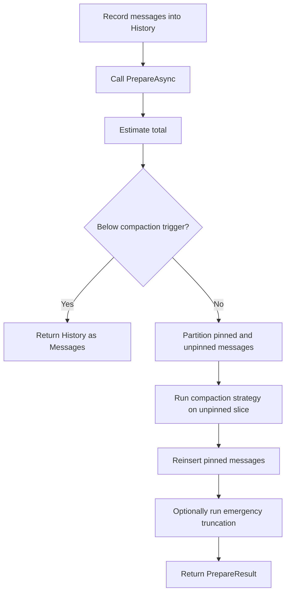

# How TokenGuard Thinks About Context

TokenGuard manages one hard problem in long-running agent loops: every model call must resend the conversation, but most
of that conversation quickly becomes stale. This document explains how the current implementation handles that pressure.

---

## 1. Why context management exists

LLMs are stateless from the application's point of view. Each request resends the active conversation. Agent loops make
this expensive fast:

1. model responds
2. model requests tools
3. app executes tools
4. app records tool results
5. next request resends all of it

Without compaction, input tokens grow cumulatively across the session. Eventually one of three things happens:

- prompt cost becomes unreasonable
- latency climbs because every request carries stale history
- provider rejects the request when the context window is exceeded

TokenGuard keeps full recorded history for correctness, but prepares a smaller provider payload when pressure rises.

---

## 2. Two views of the conversation

TokenGuard maintains two distinct views:

- **History**: `ConversationContext.History` is the full recorded transcript. Recording APIs append to this list. It is
  never compacted in place.
- **Prepared view**: `PrepareAsync()` returns a `PrepareResult`. `PrepareResult.Messages` is the list to send to the
  provider for the next call.

That separation is the central design choice. Recorded history stays complete. Prepared history is ephemeral.


```mermaid
flowchart TD
    A[Record messages into History] --> B[Call PrepareAsync]
    B --> C[Estimate total]
    C --> D{Below compaction trigger?}
    D -- Yes --> E[Return History as Messages]
    D -- No --> F[Partition pinned and unpinned messages]
    F --> G[Run compaction strategy on unpinned slice]
    G --> H[Reinsert pinned messages]
    H --> I[Optionally run emergency truncation]
    I --> J[Return PrepareResult]
```

Because `PrepareAsync()` always reevaluates full history, compaction can run on every later turn once the session is
large enough. That is expected. The prepared view is not persisted back into history.

---

## 3. What `PrepareAsync()` actually returns

`PrepareAsync()` returns `PrepareResult`, not a bare message list.

| Property | Meaning |
|---|---|
| `Messages` | Prepared message list for the provider call |
| `Outcome` | `Ready`, `Compacted`, `CompactionInsufficient`, or `CannotCompact` |
| `TokensBeforeCompaction` | Estimated total before any compaction or truncation ran |
| `TokensAfterCompaction` | Estimated total of the returned `Messages` |
| `MessagesCompacted` | Count of messages replaced or dropped during this call |
| `MessagesDropped` | Count of messages removed specifically by emergency truncation |
| `BudgetFailureReason` | Diagnostic text for over-budget outcomes |

That shape matters for consumers:

```csharp
var prepared = await context.PrepareAsync(cancellationToken);

if (prepared.Outcome == PrepareOutcome.CannotCompact)
    throw new InvalidOperationException(prepared.BudgetFailureReason);

var requestMessages = prepared.Messages.ForOpenAI();
```

The adapters operate on `PrepareResult.Messages`, not on `PrepareResult` directly.

---

## 4. Token estimation and anchor correction

TokenGuard needs an estimate before sending a request, but provider truth is only known after the request completes.

The built-in `EstimatedTokenCounter` is more than a character-count heuristic:

- every `ContextMessage` includes fixed framing overhead
- tool segments include envelope and field overhead
- JSON-like payloads are counted structurally
- Unicode, punctuation, code-like text, paths, and emoji are handled with specialized heuristics
- the built-in factory uses `new EstimatedTokenCounter()` with `TokenCountSafetyMode.Balanced`
- public DI and factory configuration do not expose a token-counter replacement hook today

So the real shape is closer to:

```csharp
var total = messageOverhead
          + segmentEstimates
          + toolEnvelopeOverhead
          + optionalSafetyMargin;
```

This still is an estimate. To reduce systematic drift, `RecordModelResponse(..., providerInputTokens)` feeds actual
provider counts back into the context.

The anchor correction is:

```text
anchorCorrection = providerInputTokens - lastPreparedEstimate
```

`PrepareAsync()` adds that correction to later pre-compaction totals. This lets TokenGuard compensate when the heuristic
is consistently high or low for a given provider and workload.

After a compaction path runs, TokenGuard:

- updates `_lastEstimatedTotalTokens` to the final prepared estimate
- resets `_anchorCorrection` to `0`

The reset is important because the correction was calibrated against the previously prepared message shape. Reusing it
after masking, summarization, or truncation would bias the next threshold check.

---

## 5. The compaction pipeline

The built-in pipeline is `TieredCompactionStrategy`:

1. sliding-window masking always runs first
2. LLM summarization runs only if masking still exceeds the available token budget and a summarizer is registered
3. emergency truncation runs afterward inside `ConversationContext` when the prepared result is still above the
   emergency trigger

The threshold check in `ConversationContext` is against the full history estimate plus any active anchor correction:

```text
totalBeforeCompaction = sum(history) + anchorCorrection
```

If that total is below `ContextBudget.CompactionTriggerTokens`, the context returns `Ready` and skips all strategy work.

If it is above the trigger:

1. pinned messages are extracted
2. their token cost is subtracted from `MaxTokens`
3. only the unpinned slice is passed to the strategy as `availableTokens`
4. pinned messages are reinserted at their original positions
5. emergency truncation may remove old unpinned turn groups from the prepared list
6. `PrepareResult` is built from the final prepared list

That means the strategy budget in the current implementation is computed as `MaxTokens - pinnedTokenTotal`.

---

## 6. Sliding-window masking

`SlidingWindowStrategy` is the always-on first stage.

It walks backward from the newest compactable message and builds a protected tail:

- it always protects at least `SlidingWindowOptions.WindowSize` newest messages
- after that floor is satisfied, it keeps expanding the tail while token cost stays within
  `availableTokens * ProtectedWindowFraction`

Messages before the boundary stay in place, but older `ToolResultContent` segments are replaced with placeholders.

```text
[Tool result cleared — read_file, call_abc123]
```

Only the `Content` string changes. The segment **stays** `ToolResultContent`. That detail is crucial because provider
adapters dispatch on segment type.

If masking changed the segment to `TextContent`, the OpenAI adapter would silently skip the tool message, leaving the
preceding assistant tool call without a matching tool result. Provider request would be invalid.

Non-tool segments are untouched. Reasoning text is not rewritten by the masking stage.

---

## 7. LLM summarization

LLM summarization is optional. It is added only through provider extension methods such as:

- `UseLlmSummarization(chatClient)`
- `UseLlmSummarization(anthropicClient, model)`

When enabled, `TieredCompactionStrategy` still runs sliding-window masking first. If the masked result already fits,
summarization is skipped. If masking still does not fit, the summarization stage receives the **original compactable
messages**, not the masked result. That preserves full tool-result payloads for better summary quality.

### Protected tail

`LlmSummarizationStrategy` keeps a protected newest-message tail verbatim and summarizes only the prefix before it.

The boundary logic is stricter than "last N messages":

- if turn markers exist, the tail expands to keep whole recorded turns together
- if the tail would start on a tool result, the boundary moves backward to include the model message that requested that
  tool call

The result is:

- one synthetic summary message with `MessageRole.Model`
- `CompactionState.Summarized`
- unchanged protected tail messages after it

### Summary budgets

`LlmSummarizationOptions` controls three things:

| Option | Meaning | Default |
|---|---|---|
| `WindowSize` | Newest compactable messages preserved verbatim | 5 |
| `MinSummaryTokens` | Minimum remaining budget required before the first summarization call is made | 2,048 |
| `MaxSummaryTokens` | Maximum target budget forwarded to the summarizer | 4,096 |

For a first-time summary:

- if `remainingBudget < MinSummaryTokens`, summarization is skipped
- otherwise target tokens are `min(remainingBudget, MaxSummaryTokens)`

For checkpoint rewrites, TokenGuard clamps the target into `[MinSummaryTokens, MaxSummaryTokens]`.

### Checkpoint reuse and promotion

The current implementation already caches summary checkpoints inside `LlmSummarizationStrategy`.

That checkpoint stores:

- how many raw messages were summarized
- a fingerprint of that prefix
- the summary message itself

Later calls can:

- reuse the cached summary if the old prefix still matches and the result still fits
- promote the checkpoint when more messages become old enough to summarize
- refresh the same checkpoint with a smaller summary when budget shrinks

This is why summarization does **not** blindly make a fresh LLM call every turn.

### Important lifecycle constraint

`LlmSummarizationStrategy` is intentionally stateful. One instance is expected to serve one conversation flow at a time.
The built-in factory respects this by creating a fresh strategy instance for each `ConversationContext`.

---

## 8. Pinned messages and system prompts

`SetSystemPrompt(...)` records a pinned system message. `AddPinnedMessage(...)` lets callers pin arbitrary messages.

Pinned messages:

- are excluded from masking
- are excluded from summarization
- are excluded from emergency truncation
- are reinserted at their original recorded positions after the normal compaction strategy runs
- still count against the total budget

If pinned messages alone exceed `MaxTokens`, `PrepareAsync()` throws `PinnedTokenBudgetExceededException`. In that case
there is no compactable room left to work with.

### Known limitation

Mid-conversation pinned messages interact awkwardly with summarization. The summarizer only sees the compactable
(unpinned) stream. If you pin a message in the middle of an active conversation, a later summary can represent content
that originally spanned both sides of that pinned boundary, and the summary message will still be placed before the
pinned message in the prepared output.

Pinning is therefore best suited to durable setup-time context.

---

## 9. Emergency truncation

Emergency truncation is a final safety net inside `ConversationContext`. It is **not** the primary strategy.

Default behavior:

- `ContextBudget.For(...)` and `ConversationConfigBuilder` set `EmergencyThreshold` to `1.0`
- that means the emergency stage fires only at the absolute token limit
- calling `WithoutEmergencyThreshold()` disables it completely

When emergency truncation runs, it drops oldest eligible unpinned **turn groups** from the prepared list. It does not
drop arbitrary individual messages, because tool-call/tool-result structure must remain valid.

### Preserved floor

Emergency truncation never truncates past the preserved floor.

That floor is:

- the summary message and everything after it, when a summarized message exists
- otherwise the newest unpinned message, repaired backward if needed to include the model message that produced a tool
  result tail
- when the conversation ends with a model reply, TokenGuard also preserves the triggering user message

If that preserved floor is still above the emergency threshold, TokenGuard returns the over-budget floor unchanged. It
prefers preserving the newest indispensable tail over forcing a structurally broken fit.

---

## 10. Outcomes and overrun tolerance

`PrepareOutcome` is computed after compaction and emergency truncation finish.

| Outcome | Meaning |
|---|---|
| `Ready` | Total stayed below the compaction trigger, no compaction ran |
| `Compacted` | Compaction ran and the final estimate fits within the allowed ceiling |
| `CompactionInsufficient` | Some messages were compacted or dropped, but the final estimate still exceeds the allowed ceiling |
| `CannotCompact` | Final estimate still exceeds the allowed ceiling and no safe compaction or truncation was possible |

The allowed ceiling is not always exactly `MaxTokens`.

`ContextBudget` also carries `OverrunTolerance`, which defaults to `0.05`. That means `PrepareOutcome.Compacted` is
still returned when:

```text
finalTokens <= MaxTokens + OverrunToleranceTokens
```

This tolerance exists because the estimator can be slightly pessimistic for some providers and workloads.

---

## 11. Provider adapter layer

TokenGuard's internal message model is provider-agnostic:

- roles: `System`, `User`, `Model`, `Tool`
- segments: `TextContent`, `ToolUseContent`, `ToolResultContent`

Adapters translate that model at the call site.

### OpenAI

`ForOpenAI()` converts `IReadOnlyList<ContextMessage>` into `IReadOnlyList<ChatMessage>`.

Important behavior:

- system and user text become normal chat messages
- model tool calls become `AssistantChatMessage.ToolCalls`
- tool results become `ToolChatMessage`
- the adapter validates tool-call/tool-result pairing and throws if a tool result has no preceding tool call or if a
  non-tool message appears before pending tool calls are satisfied

### Anthropic

`ForAnthropic()` returns a tuple:

```csharp
var (messages, systemPrompt) = prepared.Messages.ForAnthropic();
```

That shape exists because Anthropic carries system content separately from the main message array.

Anthropic input-token anchoring is conditional. `response.InputTokens()` only works when the SDK response includes
`usage`. If usage data is omitted, record the model response without the optional provider token count and TokenGuard
continues on heuristic estimates.

---

## 12. Configuration reference

### Minimal setup

```csharp
var config = ConversationConfigBuilder.Default(maxTokens: 200_000);
```

That gives you:

- `MaxTokens = 200_000`
- `CompactionThreshold = 0.80`
- `EmergencyThreshold = 1.0`
- `OverrunTolerance = 0.05`
- default sliding-window masking
- no LLM summarization provider
- built-in `EstimatedTokenCounter` with `TokenCountSafetyMode.Balanced`

### Full builder

```csharp
var config = new ConversationConfigBuilder()
    .WithMaxTokens(200_000)
    .WithCompactionThreshold(0.75)
    .WithEmergencyThreshold(0.92)
    .WithOverrunTolerance(0.02)
    .WithSlidingWindowOptions(new SlidingWindowOptions(
        windowSize: 15,
        protectedWindowFraction: 0.70,
        placeholderFormat: "[cleared: {0} / {1}]"))
    .Build();
```

Current public builder surface stops there. It does not expose `WithTokenCounter(...)`, `WithStrategy(...)`, or
reserved-token configuration.

### `ContextBudget`

| Property | Meaning |
|---|---|
| `MaxTokens` | Hard context budget configured for the conversation |
| `CompactionThreshold` | Fraction of `MaxTokens` where normal compaction begins |
| `EmergencyThreshold` | Fraction of `MaxTokens` where emergency truncation begins, or `null` when disabled |
| `OverrunTolerance` | Fraction of `MaxTokens` tolerated when classifying the final outcome |
| `CompactionTriggerTokens` | `floor(MaxTokens * CompactionThreshold)` |
| `EmergencyTriggerTokens` | `floor(MaxTokens * EmergencyThreshold)` when enabled |
| `OverrunToleranceTokens` | `floor(MaxTokens * OverrunTolerance)` |

### `SlidingWindowOptions`

| Property | Default | Meaning |
|---|---|---|
| `WindowSize` | 10 | Minimum newest compactable messages always preserved |
| `ProtectedWindowFraction` | 0.80 | Max fraction of `availableTokens` the protected tail may consume after the floor is satisfied |
| `PlaceholderFormat` | `"[Tool result cleared — {0}, {1}]"` | Placeholder format for masked tool results |

### `LlmSummarizationOptions`

| Property | Default | Meaning |
|---|---|---|
| `WindowSize` | 5 | Newest compactable messages always preserved verbatim |
| `MinSummaryTokens` | 2,048 | Minimum remaining budget before the first summarization call is made |
| `MaxSummaryTokens` | 4,096 | Maximum target budget forwarded to the summarizer |

---

## 13. Agent loop pattern

OpenAI example:

```csharp
using TokenGuard.Core.Enums;
using TokenGuard.Extensions.OpenAI;

using var context = conversationContextFactory.Create();

context.SetSystemPrompt("You are an agent...");
context.AddUserMessage(taskText);

while (true)
{
    var prepared = await context.PrepareAsync(cancellationToken);

    if (prepared.Outcome == PrepareOutcome.CannotCompact)
        throw new InvalidOperationException(prepared.BudgetFailureReason);

    var chatMessages = prepared.Messages.ForOpenAI();
    var response = await chatClient.CompleteChatAsync(chatMessages, chatOptions, cancellationToken);

    context.RecordModelResponse(response.ResponseSegments(), response.InputTokens());

    foreach (var toolCall in response.ToolCalls)
    {
        var result = ExecuteTool(toolCall.FunctionName, toolCall.FunctionArguments);
        context.RecordToolResult(toolCall.Id, toolCall.FunctionName, result);
    }

    if (response.ToolCalls.Count == 0)
        break;
}
```

The important invariant is simple: record everything into history, call `PrepareAsync()` immediately before the next
provider request, and send `prepared.Messages`.

---

## 14. Benchmark snapshot

Current public benchmark data comes from Codexplorer across 20 repository-analysis tasks:

| Metric | Value |
|---|---:|
| Cumulative prompt tokens without TokenGuard | 128,058,079 |
| Cumulative prompt tokens with TokenGuard | **16,158,357** |
| Tokens saved | **111,899,722** |
| Reduction | **87.4%** |
| Successful turns | **1,269 / 1,324** |
| `CompactionInsufficient` turns | **55 / 1,324** |
| `CannotCompact` turns | **0** |

Those numbers reflect the current masking + summarization + emergency fallback pipeline, not a masking-only prototype.

---

## 15. Current limitations

- `LlmSummarizationStrategy` is stateful. Reuse one instance for one conversation only. The built-in factory already does
  this correctly.
- Mid-conversation pinned messages can produce summary ordering that does not perfectly reflect the original pinned
  boundary.
- The built-in token counter is still heuristic. Anchor correction narrows systematic drift, but it is not a provider
  tokenizer.
